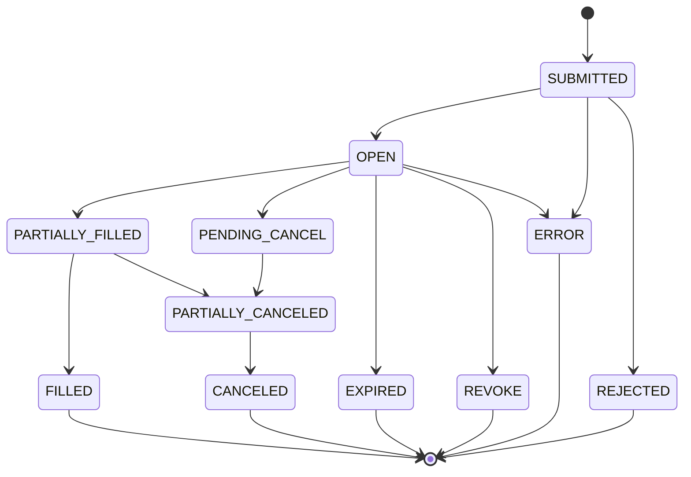

# Algo724 Cadenza Lite API


> ___🪐 When strategies meet applications___
>
> _Algo724 is building the best quantitative, scalable and evolving trading architecture solution, connecting
world-class assets for financial institutions and retails_

- [Algo724 Cadenza Lite API](#algo724-cadenza-lite-api)
    - [Overview](#overview)
    - [Authentication](#authentication)
        - [Token Usage and API Calls](#token-usage-and-api-calls)
        - [Security Considerations](#security-considerations)
        - [IAM Based Authentication](#iam-based-authentication)
        - [Get User Information](#get-user-information)
    - [Health Check](#health-check)
    - [Error Handling](#error-handling)
        - [Response Body Format](#response-body-format)
        - [Error Codes and Descriptions](#error-codes-and-descriptions)
    - [Rate Limit](#rate-limit)
        - [Cadenza Lite Rate Limit](#cadenza-lite-rate-limit)
        - [External Exchange Rate Limits](#external-exchange-rate-limits)
    - [Account Management](#account-management)
        - [Account Configuration](#account-configuration)
            - [Add Exchange Account](#add-exchange-account)
            - [Update Exchange Account](#update-exchange-account)
            - [Remove Exchange Account](#remove-exchange-account)
            - [List Exchange Accounts](#list-exchange-accounts)
    - [Market Data](#market-data)
        - [List Available Trading Symbols](#list-available-trading-symbols)
        - [Realtime Quotes (Level 1)](#realtime-quotes-level-1)
        - [Realtime Orderbook (Level 2)](#realtime-orderbook-level-2)
        - [Historical Data/Candlestick (Kline)](#historical-datacandlestick-kline)
            - [Historical Data Limitations](#historical-data-limitations)
    - [Trade](#trade)
        - [8.1 Supported Order Types](#81-supported-order-types)
            - [Order status](#order-status)
        - [8.2. Place Order Idempotency](#82-place-order-idempotency)
        - [8.3. Order](#83-order)
            - [Place Order](#place-order)
            - [Cancel Order](#cancel-order)
            - [List Orders](#list-orders)
            - [Close Position](#close-position)
        - [8.4. Request For Quote (RFQ)](#84-request-for-quote-rfq)
            - [Request For Quote](#request-for-quote)
        - [8.5. Order Definition](#85-order-definition)
    - [Portfolio](#portfolio)
        - [List Balances](#list-balances)
        - [List Positions](#list-positions)
        - [List Credit](#list-credit)

## Overview

Algo724 Trading Engine Web Server API is an API that provides a unified interface for interacting with various
cryptocurrency exchanges. It allows users to manage their exchange accounts, access real-time market data, and place
orders across multiple exchanges, all from a single interface. This document provides an overview of the API's features
and functionality.

- __Account Management__: The API allows users to connect and manage their exchange accounts, including adding,
  updating, and removing accounts.
- __Market Data__: The API provides access to real-time and historical market data from various exchanges. It supports
  various data types, including quotes, order books, and candlestick charts.
- __Trade__: The API allows users to place orders on various exchanges. It supports various order types, including
  market, limit, stop, and others.
- __Portfolio__: The API provides access for users to manage exchange accounts, including their balances,
  positions, and other relevant information.

## Authentication

### Token Usage and API Calls

Access control for API endpoints in this system is managed through Google Cloud's Identity and Access Management (IAM).
IAM roles determine who (users, services, etc) has authorization to access which resources.

### Security Considerations

- **Token Storage**: Securely store tokens to ensure they are not exposed to unauthorized entities.
- **SSL Enforcement**: Use SSL for all communications to prevent data interception.

### IAM Based Authentication

Instead of managing different token types (`access_token`, `refresh_token`), this system uses Google Cloud IAM's
authentication. Here is a step-by-step guide to how it works:

1. **Retrieve IAM Token**: Fetch an IAM token. This serves as your bearer token for authentication. In a typical setup,
   this would be retrieved from Google Cloud using the following command: `gcloud auth print-identity-token`.

2. **API Calls**: Include this token in the `Authorization` header when making API calls like
   so: `Authorization: Bearer <iam_token>`.

3. **Token Lifetime**: IAM tokens are short-lived, typically expiring after 60 min. You need to get a new token after
   the current one expires.

By using Google's IAM for managing authentication, we leverage Google's robust identity service to manage authenticated
access to our system resources. It streamlines the API authentication process by eliminating the need for token refresh
flows.

The process is outlined in the security scheme in your OpenAPI specification:

```yaml
  securitySchemes:
    BearerAuth:
      type: http
      scheme: bearer
      bearerFormat: JWT
```

### Get User Information

- **Endpoint**: `GET /api/v2/client/getInfo`

- **Result Response**: This API endpoint returns a JSON containing user-specific information. After successfully
  authenticating using an IAM bearer token, the server will return a JSON object containing the available exchange types
  for the user.

The following table details the properties of the response based on the schema:

| Parameter     | Type  | Required | Description                                       |
|---------------|-------|----------|---------------------------------------------------|
| exchangeTypes | array | Yes      | List of the available exchange types for the user |

Here is an example of the response you would get:

```json
{
  "exchangeTypes": [
    "BINANCE",
    "B2C2",
    "WINTERMUTE"
  ]
}
```

In this example, the user has three available exchange types: "BINANCE", "B2C2", and "WINTERMUTE". This data allows your
application to understand which exchanges can be used for this user. The actual availability will depend on the user's
specific account setup and access.

## Health Check

The Health Check section of the API is designed to provide a quick and efficient way to check the operational status of
the API. This is crucial for ensuring that the API is functioning correctly and is accessible for trading operations and
data retrieval.

> **Endpoint:** `GET /api/v2/health`

**Summary:**

- This endpoint serves as a simple health check for the API.
- It is used to confirm that the API is up and running without any issues.

**Responses:**

- A successful response indicates that the API is operational.
- The API will return a plain text response with the message "ok" if it is functioning properly.
- This response confirms that the API is healthy and ready for use.

## Error Handling

Algo724 trading engine reflects internal and external events, exchange business rejections, network connectivity, and
other errors through HTTP status code and error response body. The following table describes the HTTP status codes and
error response body.

#### Response Body Format

```json
{
  "code": -18001,
  "error": "Order type not supported"
}
```

- **Error Code**: The error code is a negative integer, which is unique for each error type.
- **Error Message**: Exceptions in error message can be catched and handled accordingly.

#### Error Codes and Descriptions

| Error Code | Error Message                    | Description                                              |
|------------|----------------------------------|----------------------------------------------------------|
| -18001     | Order type not supported         | The order type is not supported by the exchange          |
| -18002     | Order side not supported         | The order side is not supported by the exchange          |
| -18003     | Time in force not supported      | The time in force is not supported by the exchange       |
| -18004     | Exchange Error                   | An error occurred within the exchange                    |
| -18005     | Authentication Error             | The access token is invalid                              |
| -18006     | Insufficient funds               | Insufficient balance for order placement                 |
| -18007     | Invalid order                    | The order is invalid                                     |
| -18008     | Bad request                      | The request format or parameters are invalid             |
| -18009     | Network error                    | Network connectivity issues                              |
| -18010     | DDOS protection                  | The request was blocked by DDOS protection               |
| -18011     | Rate limit exceeded              | The rate limit for requests has been exceeded            |
| -18012     | Exchange not available           | The exchange is currently unavailable                    |
| -18013     | On maintenance                   | The exchange is under maintenance                        |
| -18015     | Request timeout                  | The request timed out                                    |
| -18016     | Exchange operation not supported | The requested operation is not supported by the exchange |
| -18017     | Symbol not found                 | The specified trading symbol is not found                |
| -18018     | Order not found                  | The specified order does not exist                       |
| -18019     | Position not found               | The specified position does not exist                    |
| -18020     | Balance not found                | The specified balance information is unavailable         |
| -18021     | Interval not supported           | The interval is not supported by the exchange            |
| -18022     | Invalid API key                  | The provided API key is invalid                          |
| -18023     | Invalid leverage                 | The specified leverage is invalid                        |
| -18024     | Not changed                      | The request did not result in any change                 |
| -18025     | Order rejected                   | The exchange rejected the order                          |
| -19002     | Unauthorized                     | Authentication is required for this request              |
| -19003     | Page not found                   | The requested endpoint is not found                      |
| -19004     | Form validation failed           | Validation of request parameters failed                  |

## Rate Limit

If your requests exceed the set rate limits, either from the Algo724 Trading Engine or the connected exchanges, you will
receive a response indicating that the rate limit has been exceeded. The response format will be as follows:

```json
{
  "code": -18011,
  "error": "Rate limit exceeded"
}
```

### Cadenza Lite Rate Limit

For the Algo724 Trading Engine, the rate limit is set to 1000 requests per minute. Exceeding this limit may result in
temporary restrictions on your API access.

### External Exchange Rate Limits

The trading capabilities provided by the Algo724 Trading Engine are also subject to the rate limits imposed by external
exchanges. Please follow the specific rate limits for supported exchanges:

- **Binance API Rate Limit**:
    - 1000 requests per minute

## Account Management

Accounts for B2C2, Wintermute, and Blockfills are pre-configured. Endpoints are available to add or delete Binance
accounts.

### Account Configuration

**Note:**

- Contact our support to set up B2C2, WinterMute, HyperEx Bridge accounts.
- Refer to the OpenAPI spec for more details regarding the endpoints.

#### Add Exchange Account

This API endpoint is used to add a new exchange account to the Algo724 Trading Engine. It requires the API keys,
exchange type, account name, and environment setting. The system will validate these keys. If the validation is
successful, the account will be added to the user's list of accounts.

> **Endpoint:** `POST /api/v2/exchange/addExchangeAccount`

**Request Body:**

| Parameter           |  Type   | Required | Description                                                                                     |
|---------------------|:-------:|:--------:|:------------------------------------------------------------------------------------------------|
| exchangeType        | string  |   Yes    | The type of exchange. Refer to the `exchangeType` schema (Values: BINANCE, B2C2, WINTERMUTE).   |
| apiKey              | string  |   Yes    | The API Key for the exchange account. Example: 'my_api_key'                                     |
| apiSecret           | string  |   Yes    | The API Secret for the exchange account. Example: 'my_api_secret'                               |
| exchangeAccountName | string  |   Yes    | An alias for this exchange account. Accepts a-z, A-Z, 0-9, _, and space. Example: 'my_exchange' |
| environment         | integer |   Yes    | The trading environment: 0 for real, 1 for sandbox. Example: 0                                  |

**Result Response:**

On a successful operation, an `okResponse` with a data property containing "ok" will be returned. If an error occurs
during the operation, an `errorResponse` with code and error message will be returned.

| Parameter |  Type   |                                           Description                                            |
|-----------|:-------:|:------------------------------------------------------------------------------------------------:|
| data      | string  |                          A string "ok" indicating successful operation.                          |
| code      | integer |  Error code, returned when there is an error in the operation. Only in `errorResponse` schema.   |
| error     | string  | Error message, returned when there is an error in the operation. Only in `errorResponse` schema. |

#### Update Exchange Account

This API endpoint enables the updating of the details of an existing exchange account in the system. Users have the
ability to modify the API keys, account alias, or switch between real and sandbox environments.

> **Endpoint:** `POST /api/v2/exchange/updateExchangeAccount`

**Request Body:**

| Parameter           | Type   | Required | Description                                                                           |
|---------------------|--------|----------|---------------------------------------------------------------------------------------|
| exchangeAccountId   | string | Yes      | The unique identifier for the account, formatted as a UUID.                           |
| exchangeAccountName | string | No       | Change nickname for this exchange account if provided.                                |
| apiKey              | string | No       | Change API Key if provided.                                                           |
| apiSecret           | string | No       | API Secret, required for exchanges like BINANCE, BINANCE_FUTURES. Change if provided. |

**Result Response:**

Upon successful operation, an `okResponse` with a data property will be returned. If there is an error during the
operation, then an `errorResponse` will be returned with code and error message.

| Parameter |  Type   |                                           Description                                            |
|-----------|:-------:|:------------------------------------------------------------------------------------------------:|
| data      | string  |                          A string "ok" indicating successful operation.                          |
| code      | integer |  Error code, returned when there is an error in the operation. Only in `errorResponse` schema.   |
| error     | string  | Error message, returned when there is an error in the operation. Only in `errorResponse` schema. |

#### Remove Exchange Account

This API endpoint enables the removal of a specific exchange account from the system. It requires the unique
identifier (formatted as a UUID) of the exchange account to be removed.

> **Endpoint:** `POST /api/v2/exchange/removeExchangeAccount`

**Request Body:**

| Parameter         | Type   | Required | Description                                          |
|-------------------|--------|----------|------------------------------------------------------|
| exchangeAccountId | string | Yes      | The unique UUID of the account intended for removal. |

**Result Response:**

On successful operation, an `okResponse` with data property "ok" will be returned. If there is an error during the
operation, then an `errorResponse` with code and error message will be returned.

| Parameter |  Type   |                                           Description                                            |
|-----------|:-------:|:------------------------------------------------------------------------------------------------:|
| data      | string  |                          A string "ok" indicating successful operation.                          |
| code      | integer |  Error code, returned when there is an error in the operation. Only in `errorResponse` schema.   |
| error     | string  | Error message, returned when there is an error in the operation. Only in `errorResponse` schema. |

#### List Exchange Accounts

This API endpoint retrieves a list of all exchange accounts attached to a user in the system. It provides key details
about each account, such as the type, associated exchange, and other relevant information.

> **Endpoint:** `GET /api/v2/exchange/listExchangeAccounts`

**Result Response:**

The response will be an array of `exchangeAccount` objects. Each object contains the following information:

| Parameter           |  Type   |                                         Description                                          |
|---------------------|:-------:|:--------------------------------------------------------------------------------------------:|
| exchangeAccountId   | string  |             The unique identifier of the exchange account, formatted as a UUID.              |
| exchangeAccountName | string  |                        The name associated with the exchange account.                        |
| exchangeType        | string  |             The type of exchange. Refer to the `exchangeType` schema in API doc.             |
| environment         | integer |                     The trading environment: 0 for real, 1 for sandbox.                      |
| status              | string  | The current status of the exchange account. Refer to the `ExchangeStatus` schema in API doc. |
| accountType         | string  |    The type of account. Refer to the `AccountType` schema in API doc, e.g., SPOT, MARGIN.    |

If an error occurs during the operation, then an `errorResponse` with code and error message will be returned.

| Parameter |  Type   |                                           Description                                            |
|-----------|:-------:|:------------------------------------------------------------------------------------------------:|
| code      | integer |  Error code, returned when there is an error in the operation. Only in `errorResponse` schema.   |
| error     | string  | Error message, returned when there is an error in the operation. Only in `errorResponse` schema. |

## Market Data

The Market Data API offers access to various trading data across multiple supported exchanges. This includes Trading
Pairs, Real-time Quotes (Level 1), Real-time Order Book (Level 2), and Historical Data/Candlestick (Kline) from Binance,
Binance Futures, B2C2, Wintermute, and HyperEx Bridge.

### List Available Trading Symbols

This API endpoint allows you to fetch a list of available trading symbols for each supported exchange.

> **Endpoint:** `GET /api/v2/market/listSymbolInfo`

**Parameters:**

| Parameter    | Type    | Required | Description                                                                       |
|--------------|---------|----------|-----------------------------------------------------------------------------------|
| exchangeType | string  | No       | Specifies the exchange type. Defaults to all supported exchanges if not provided. |
| symbol       | string  | No       | Fetch info about specific symbols if provided. Returns all if not specified.      |
| detail       | boolean | No       | When set to true, returns detailed information for each symbol. Default is false. |

**Result Response:**

The response contains an array of objects, each representing a Trading Symbol. Each object contains details of the
trading symbol including, but not limited to, symbol name, base symbol, quote symbol, minimum quantity, max quantity,
and price precision.

### Realtime Quotes (Level 1)

This API endpoint fetches real-time quotes for a specific trading symbol on a specified exchange.

> **Endpoint:** `GET /api/v2/market/ticker`

**Parameters:**

| Parameter    | Type   | Required | Description                                                        |
|--------------|--------|----------|--------------------------------------------------------------------|
| exchangeType | string | Yes      | Specifies the exchange provider for which to fetch the quote data. |
| symbol       | string | Yes      | The trading symbol for which the quote is requested.               |

**Result Response:**

The response includes a ticker object that contains details such as ask price, bid price, last price, last quantity, and
timestamps.

### Realtime Orderbook (Level 2)

This API endpoint provides order book data for a specified trading symbol on a chosen exchange.

> **Endpoint:** `GET /api/v2/market/orderbook`

**Parameters:**

| Parameter    | Type    | Required | Description                                                             |
|--------------|---------|----------|-------------------------------------------------------------------------|
| exchangeType | string  | Yes      | The exchange provider for which to fetch the order book data.           |
| symbol       | string  | Yes      | The trading symbol for which to fetch the order book data.              |
| limit        | integer | No       | Limits the number of returned results. Default is 100; maximum is 1000. |

**Result Response:**

The response includes a list of bids and asks for the particular symbol on the specified exchange.

### Historical Data/Candlestick (Kline)

This API endpoint provides historical candlestick data on a specified trading symbol from a given exchange.

> **Endpoint:** `GET /api/v2/market/kline`

**Parameters:**

| Parameter    | Type    | Required | Description                                                                     |
|--------------|---------|----------|---------------------------------------------------------------------------------|
| exchangeType | string  | Yes      | The exchange provider from which to fetch the candlestick data.                 |
| symbol       | string  | Yes      | The trading symbol for which the Kline data is requested.                       |
| interval     | string  | Yes      | The time interval for the Klines.                                               |
| startTime    | integer | No       | Start time for the query in milliseconds since the Unix epoch. Defaults to 100. |
| endTime      | integer | No       | End time for the query in milliseconds since the Unix epoch. Maximum is 1000.   |
| limit        | integer | No       | Limits the number of returned Klines. Default is 100; maximum is 1000.          |

**Result Response:**

The response contains an array of `OHLCV` (open, high, low, close, volume) objects, each representing a candlestick for
the specified trading symbol and interval within the requested time range. It includes fields like open price (`o`),
high price (`h`), low price (`l`), close price (`c`), and volume (`v`), along with the timestamp (`t`).

#### Historical Data Limitations

Historical market data has it’s own set of market data limitations unique to other requests such as real time market
data.

The following table shows the limitation of each exchange:

| Exchange        | Max Kline Data Points per Request | Historical Data |
|-----------------|-----------------------------------|-----------------|
| Binance         | 1000                              | 5 Years         |
| Binance Futures | 1000                              | 5 Years         |

## Trade

### Supported Order Types

The available order configuration varies across different exchanges, please refer to the table below for more
information. (Order Type, Exchange, Time in Force) combination supported by each exchange:

| Order Type              | Binance                 | B2C2  | WinterMute | BlockFills | HyperEx Bridge                   |
|-------------------------|-------------------------|-------|------------|------------|----------------------------------|
| Market Order            | `GTC`<br>`IOC`<br>`FOK` | `GTC` |            | `FOK`      | `DAY`<br>`GTC`<br>`IOC`<br>`FOK` |
| Limit Order             | `GTC`<br>`IOC`<br>`FOK` | `FOK` | `FOK`      |            | `DAY`<br>`GTC`<br>`IOC`<br>`FOK` |
| Stop Loss Order         | `GTC`<br>`IOC`<br>`FOK` |       |            |            |                                  |
| Stop Loss Limit Order   | `GTC`<br>`IOC`<br>`FOK` |       |            |            |                                  |
| Take Profit Order       | `GTC`<br>`IOC`<br>`FOK` |       |            |            |                                  |
| Take Profit Limit Order | `GTC`<br>`IOC`<br>`FOK` |       |            |            |                                  |
| Quoted Order            |                         |       | `FOK`      |            |                                  |

#### Order status

| Order Status       | Description                                                                       |
|--------------------|-----------------------------------------------------------------------------------|
| SUBMITTED          | The order has been submitted to the exchange where status on exchange is unknown. |
| OPEN               | The order has been submitted to the exchange and is waiting to be filled.         |
| PARTIALLY_FILLED   | The order has been partially filled.                                              |
| PARTIALLY_CANCELED | The order has been partially canceled.                                            |
| PENDING_CANCEL     | The order is pending cancellation.                                                |
| ERROR              | The order has encountered an error.                                               |
| FILLED             | The order has been filled.                                                        |
| CANCELED           | The order has been canceled.                                                      |
| REJECTED           | The order has been rejected.                                                      |
| REVOKE             | The order has been revoked by exchange                                            |
| EXPIRED            | The order has expired.                                                            |

**NOTE**:  it's relatively rare for the exchange to return a PENDING_ status, but it's possible that the order is in a
pending state.

Here is the state diagram of the order lifecycle:



### Idempotency

If Idempotency key is provided in Header, the server will check if the order with the same idempotency key has been
placed before, if so, the server will return the same response as the previous request.

The idempotency key is used to prevent the same request being processed multiple times. The idempotency key should be
passed in the header of the HTTP request. The header should in the format of "`Idempotency-Key: <idempotency_key>`". If
the same request is received multiple times, the server will return the same response for all the requests. The
idempotency key is only valid for 30 minutes, after 30 minutes, the same request will be processed as a new request.
UUID-V4 is recommended for generating the idempotency key.

If the initial request is processing, the server will return the HTTP status code 202 with the response in JSON format.
The response will be in the following format:

```json
{
  "data": "processing"
}
```

### Smart Order Routing

Smart Order Routing is a mechanism for handling invalid orders and executing them based on a set route policy and
priority of exchanges. This procedure assists in order management and execution, particularly in scenarios with
insufficient balance or quantity limits.

#### Route Policy

The `POST /api/v2/trading/placeOrder` endpoint employs the route policy for order validation and execution
when `{"routePolicy": "priority"}` is included in the request payload.

- **"priority"**: If the order is determined invalid, the system routes the order to the next account based on the
  user-set priority. The user can overwrite the priority set in the database by adding a `priority` attribute in the
  request payload. The system then utilizes this `priority` for executing the order.

#### Handling Invalid Orders

An invalid order contains the following characteristics:

- Order quantity is less than the minimum or exceeds the maximum limit.
- Insufficient account balance to execute the order.

In such cases, the system follows the Route Policy to attempt order execution via the next account based on priority,
ensuring a straightforward fallback mechanism.

#### Set Exchange Priority

The system prioritizes accounts for invalid order execution, beginning with the account of the highest priority. It
proceeds down the priority tiers - if the highest priority account fails to execute the order, the system attempts order
execution via the next account based on priority. If no accounts are capable of executing the order, an error is
returned.

The `POST /api/v2/exchange/setExchangePriority` function allows users to set the priority of exchanges. In an array, the
first exchange possesses the highest priority and the last exchange the lowest.

> **Endpoint:** `POST /api/v2/exchange/setExchangePriority`

**Request Body:**

| Parameter | Type  | Required | Description                                                                                                             |
|-----------|-------|----------|-------------------------------------------------------------------------------------------------------------------------|
| priority  | array | Yes      | List of exchanges in descending order of priority. The first exchange in the array gets the highest priority and so on. |

#### Place Order With Route Policy

> **Endpoint:** `POST /api/v2/trading/placeOrder`

The Place Order endpoint (`POST /api/v2/trading/placeOrder`) has the following parameters:

Headers

| Parameter       | Type   | Required | Description                                                                                 |
|-----------------|--------|----------|---------------------------------------------------------------------------------------------|
| Idempotency-Key | string | Yes      | An idempotency key is used to ensure that the same request is not processed more than once. |

Request Body

| Parameter         | Type    | Required | Description                                                                                                                       |
|-------------------|---------|----------|-----------------------------------------------------------------------------------------------------------------------------------|
| exchangeAccountId | UUID    | Yes      | A unique identifier specifying the exchange account for the trade.                                                                |
| leverage          | integer | No       | Specifies the leverage for the trade.                                                                                             |
| orderSide         | string  | Yes      | Indicates the side (BUY/SELL) of the order.                                                                                       |
| orderType         | string  | Yes      | Defines the type of the order.                                                                                                    |
| positionId        | UUID    | No       | Specifies the position ID for closing a position in margin trading.                                                               |
| price             | number  | No       | Sets the price for the order.                                                                                                     |
| quantity          | number  | Yes      | Determines the quantity for the order.                                                                                            |
| symbol            | string  | Yes      | The trading pair symbol for the order (e.g., BTC/USDT).                                                                           |
| timeInForce       | string  | Yes      | Specifies the period during which the order remains active.                                                                       |
| routePolicy       | string  | No       | Sets the route policy. If `PRIORITY` is chosen, it would entail that the system would use the user priority to execute the order. |
| priority          | array   | No       | Defines a list of exchange account IDs in descending order of priority. Used when route policy is set to `PRIORITY`.              |
| quoteId           | string  | No       | A unique quote ID obtained from the exchange via the `GET /api/v2/trading/fetchQuotes` endpoint, used when placing an order.      |

### Order Management

#### Place Order

This API endpoint allows users to execute trading orders on specified exchange accounts within the Algo724 Trading
Engine.

> **Endpoint:** `POST /api/v2/trading/placeOrder`

**Headers:**

| Header          | Type   | Required | Description                                                                        |
|-----------------|--------|----------|------------------------------------------------------------------------------------|
| Idempotency-Key | string | No       | A unique key to prevent the system from executing the same request multiple times. |

**Request Body:**

| Parameter         | Type    | Required | Description                                                                                            |
|-------------------|---------|----------|--------------------------------------------------------------------------------------------------------|
| exchangeAccountId | UUID    | Yes      | The unique identifier of the exchange account for the trade.                                           |
| leverage          | integer | No       | Specifies the leverage for the trade.                                                                  |
| orderSide         | string  | Yes      | Determines the side (BUY/SELL) of the order.                                                           |
| orderType         | string  | Yes      | Defines the type of the order.                                                                         |
| positionId        | UUID    | No       | Indicates the position ID for closing a position in margin trading.                                    |
| price             | number  | No       | Sets the price for the order.                                                                          |
| quantity          | number  | Yes      | Determines the quantity for the order.                                                                 |
| symbol            | string  | Yes      | Indicates the trading pair symbol for the order.                                                       |
| timeInForce       | string  | Yes      | Specifies the time duration during which the order remains active.                                     |
| quoteId           | string  | No       | This unique quote ID is obtained from the exchange via the `GET /api/v2/trading/fetchQuotes` endpoint. |

**Result Response:**

The response provides detailed information about the executed order encapsulated in `Order` objects.

Each `Order` object includes the following:

| Parameter         | Type   | Description                                                                                       |
|-------------------|--------|---------------------------------------------------------------------------------------------------|
| orderId           | UUID   | A unique identifier assigned to the trade.                                                        |
| userId            | UUID   | A unique identifier assigned to the user who placed the order.                                    |
| exchangeAccountId | UUID   | A unique identifier for the specific exchange where the trade occurred.                           |
| positionId        | UUID   | A unique identifier for the position associated with the trade.                                   |
| symbol            | string | The trading pair symbol (for example, 'BTC/USDT'). Make sure to use uppercase letters.            |
| quantity          | number | The amount of the asset being traded in the order.                                                |
| orderType         | string | The category of trade order (e.g., MARKET, LIMIT, STOP).                                          |
| orderSide         | string | The orientation of the trade (e.g., BUY, SELL).                                                   |
| timeInForce       | string | The duration over which the order should remain active (e.g., GTC, IOC, FOK).                     |
| cost              | number | The total cost of the trade.                                                                      |
| filled            | number | The amount of the asset filled in the trade.                                                      |
| status            | string | The latest status of the trade (e.g., FILLED, CANCELED).                                          |
| createdAt         | int    | The timestamp indicating when the trade was created (Unix Milli format e.g., 1703052635110).      |
| updatedAt         | int    | The timestamp indicating when the trade was last updated (Unix Milli format e.g., 1703052635111). |

#### Cancel Order

This API endpoint enables users to cancel an open order on their specified exchange accounts within the Algo724 Trading
Engine.

> **Endpoint:** `POST /api/v2/trading/cancelOrder`

**Request Body:**

| Parameter | Type | Required | Description                                                            |
|-----------|------|----------|------------------------------------------------------------------------|
| orderId   | UUID | Yes      | A unique identifier of the order to be cancelled, formatted as a UUID. |

**Result Response:**

The response delivers detailed information about the cancelled order, represented as an `Order` object:

| Parameter         | Type   | Description                                                                                       |
|-------------------|--------|---------------------------------------------------------------------------------------------------|
| orderId           | UUID   | A unique identifier assigned to the order.                                                        |
| userId            | UUID   | A unique identifier assigned to the user who placed the order.                                    |
| exchangeAccountId | UUID   | A unique identifier for the specific exchange where the order was placed.                         |
| positionId        | UUID   | A unique identifier for the position associated with the order.                                   |
| symbol            | string | The trading pair symbol (for example, 'BTC/USDT'). Make sure to use uppercase letters.            |
| quantity          | number | The amount of the asset being traded in the order.                                                |
| orderType         | string | The category of trade order (e.g., MARKET, LIMIT, STOP).                                          |
| orderSide         | string | The orientation of the trade (e.g., BUY, SELL).                                                   |
| timeInForce       | string | The duration over which the order should remain active (e.g., GTC, IOC, FOK).                     |
| cost              | number | The total cost of the trade.                                                                      |
| filled            | number | The amount of the asset filled in the trade.                                                      |
| status            | string | The latest status of the trade (e.g., FILLED, CANCELED).                                          |
| createdAt         | int    | The timestamp indicating when the trade was created (Unix Milli format e.g., 1703052635110).      |
| updatedAt         | int    | The timestamp indicating when the trade was last updated (Unix Milli format e.g., 1703052635111). |

#### List Orders

This API endpoint retrieves a list of orders for the user's account, allowing further filtering based on various
parameters such as order ID, order status, order type, trading symbol, and time range.

> **Endpoint:** `GET /api/v2/trading/listOrders`

**Parameters:**

| Parameter | Type    | Required | Description                                                                                             |
|-----------|---------|----------|---------------------------------------------------------------------------------------------------------|
| orderId   | string  | No       | The unique identifier of a specific order. Allows filtering of a certain order.                         |
| status    | string  | No       | Filter by the status of the orders (e.g., OPEN, FILLED)                                                 |
| orderType | string  | No       | Filter by the type of the orders (e.g., MARKET, LIMIT)                                                  |
| symbol    | string  | No       | Filter orders by the trading symbol (e.g., BTC/USDT)                                                    |
| startTime | integer | No       | Start time for the query, in milliseconds since Unix epoch.                                             |
| endTime   | integer | No       | End time for the query, in milliseconds since Unix epoch.                                               |
| offset    | integer | No       | Offset for pagination, useful for fetching orders in a paginated manner.                                |
| limit     | integer | No       | Limit for the number of orders returned in the query. Default value is 100 with the maximum being 1000. |

**Result Response:**

The response from the List Orders API endpoint provides an array of `Order` objects. These objects offer detailed
information about each order based on the supplied parameters. The data is included in the `ListOrderResponse` object
which consists of:

| Parameter | Type    | Description                                                      |
|-----------|---------|------------------------------------------------------------------|
| data      | array   | Contains `Order` objects, each representing a specific order.    |
| limit     | integer | Indicates the maximum number of orders included in the response. |
| offset    | integer | Indicates the starting point for the order data in the response. |

The `Order` objects within the `data` field provide exhaustive details about each order:

| Parameter | Type | Description |
|-------------------|--------| |-------------------|--------|----------------------------------------------------------------------------------|
| orderId | UUID | A unique identifier assigned to the order. |
| userId | UUID | A unique identifier assigned to the user who placed the order. |
| exchangeAccountId | UUID | A unique identifier for the specific exchange where the order was placed. |
| positionId | UUID | A unique identifier for the position associated with the order. |
| symbol | string | The trading pair symbol (for example, 'BTC/USDT'). Use uppercase letters. |
| quantity | number | The amount of the asset being traded in the order. |
| orderType | string | The category of the trade order (e.g., MARKET, LIMIT, STOP). |
| orderSide | string | The orientation of the trade (e.g., BUY, SELL). |
| timeInForce | string | The duration the order should remain active (e.g., GTC, IOC, FOK). |
| cost | number | The total cost of the trade. |
| filled | number | The amount of the asset filled in the trade. |
| status | string | The latest status of the trade (e.g., FILLED, CANCELED). |
| createdAt | int | The timestamp indicating when the order was created (Unix Milli format). |
| updatedAt | int | The timestamp indicating when the order was last updated (Unix Milli format). |

### Request For Quote (RFQ)

This API endpoint is used to request a quote for trading. Each request results in a detailed quote presenting a specific
price at which a trade could potentially be executed.

Once you receive the quote and accept the offered price, you can execute the trade using
the `/api/v2/trading/placeOrder` endpoint.

| Exchange Type | Indicative quote | Executable quote |
|---------------|------------------|------------------|
| B2C2          | Yes              | No               |
| WinterMute    | No               | Yes              |
| BlockFills    | Yes              | No               |
| Binance       | Yes              | No               |

> **Endpoint:** `POST /api/v2/trading/fetchQuotes`

**Request Body:**

| Parameter         | Type   | Required | Description                                                                |
|-------------------|--------|----------|----------------------------------------------------------------------------|
| baseCurrency      | string | Yes      | The base currency of the trading pair for which the quote is requested.    |
| quoteCurrency     | string | Yes      | The quote currency of the trading pair.                                    |
| quantity          | number | Yes      | The quantity for which the quote is needed.                                |
| exchangeAccountId | string | No       | The unique identifier of a specific exchange account, formatted as a UUID. |
| orderSide         | string | Yes      | The order side (BUY/SELL), required by some providers like WinterMute.     |

**Result Response:**

The API response provides an array of `quoteWithOrderCandidates` objects. Each object packs detailed quote information
and potential order options.

| Parameter         | Type   | Description                                              |
|-------------------|--------|----------------------------------------------------------|
| exchangeAccountId | string | Identifies the specific exchange account.                |
| exchangeType      | string | Identifies the type of exchange offering the quote.      |
| baseCurrency      | string | Base currency of the trading pair.                       |
| quoteCurrency     | string | Quote currency of the trading pair.                      |
| askPrice          | number | Current ask (sell) price for the symbol.                 |
| askQuantity       | number | Quantity available at the ask price.                     |
| bidPrice          | number | Current bid (buy) price for the symbol.                  |
| bidQuantity       | number | Quantity available at the bid price.                     |
| timestamp         | number | Time the quote was captured (in Unix Milli format).      |
| orderCandidates   | array  | Possible orders that can be executed based on the quote. |
| quoteId           | string | Unique quote ID provided by the exchange.                |

Each `orderCandidate` within the `orderCandidates` array includes:

| Parameter | Type   | Description                                 |
|-----------|--------|---------------------------------------------|
| orderSide | string | The side of the potential order (BUY/SELL). |
| orderType | string | The type of the potential order.            |
| quantity  | number | The quantity for the potential order.       |
| symbol    | string | The trading symbol for the potential order. |

### Order Definition

The order model provides thorough information about a trade order executed on an exchange. Each order is characterized
by a specific set of attributes:

| Field             | Type   | Description                                                                                       |
|-------------------|--------|---------------------------------------------------------------------------------------------------|
| orderId           | UUID   | A unique identifier assigned to the trade.                                                        |
| userId            | UUID   | A unique identifier assigned to the user executing the trade.                                     |
| exchangeAccountId | UUID   | A unique identifier of the exchange account where the trade occurred.                             |
| exchangeType      | UUID   | A unique identifier of the type of the exchange where the trade occurred.                         |
| positionId        | UUID   | A unique identifier of the position associated with the trade. If none, it returns null.          |
| symbol            | string | The trading pair symbol (for example, 'BTC/USDT'). Make sure to use uppercase letters.            |
| quantity          | number | The amount of the asset being traded.                                                             |
| orderType         | string | The category of trade order (e.g., MARKET, LIMIT, STOP).                                          |
| orderSide         | string | The orientation of the trade (e.g., BUY, SELL).                                                   |
| timeInForce       | string | The duration over which the order should remain active (e.g., GTC, IOC, FOK).                     |
| cost              | number | The total  cost of the trade.                                                                     |
| filled            | number | The amount of the asset filled in the trade.                                                      |
| status            | string | The latest status of the trade (e.g., FILLED, CANCELED).                                          |
| createdAt         | int    | The timestamp indicating when the trade was created (Unix Milli format e.g., 1703052635110).      |
| updatedAt         | int    | The timestamp indicating when the trade was last updated (Unix Milli format e.g., 1703052635111). |

## Portfolio

### List Balances

This API endpoint allows you to retrieve balance details for a specific or all connected exchange accounts.

> **Endpoint:** `GET /api/v2/portfolio/listBalances`

**Parameters:**

| Parameter         | Type   | Required | Description                                                                                                                          |
|-------------------|--------|----------|--------------------------------------------------------------------------------------------------------------------------------------|
| exchangeAccountId | string | No       | The unique identifier of the exchange account. If not provided, balance details of all connected exchange accounts will be returned. |

**Result Response:**

The response contains an array of `exchangeBalance` objects, each representing the balance details of a specific asset
on the specified exchange account.

Each `exchangeBalance` object includes the following information:

| Parameter | Type   | Description                                                                                   |
|-----------|--------|-----------------------------------------------------------------------------------------------|
| asset     | string | The identifier of the asset (e.g., BTC/USDT).                                                 |
| free      | number | The amount of the asset that is available and not tied up in current orders (free balance).   |
| locked    | number | The amount of the asset that is currently locked or reserved in open orders (locked balance). |

### List Positions

This API endpoint allows you to retrieve detailed information about open positions for a specified exchange account or
all connected exchange accounts.

> **Endpoint:** `GET /api/v2/portfolio/listPositions`

**Parameters:**

| Parameter         | Type   | Required | Description                                                                                                                                                                   |
|-------------------|--------|----------|-------------------------------------------------------------------------------------------------------------------------------------------------------------------------------|
| exchangeAccountId | string | No       | The unique identifier of the exchange account for which position information is being queried. If not provided, positions from all connected exchange accounts may be listed. |

**Result Response:**

The endpoint returns a list of `exchangePosition` objects, each containing detailed information about an individual open
position.

Each `exchangePosition` object contains:

| Parameter    | Type   | Description                                         |
|--------------|--------|-----------------------------------------------------|
| amount       | number | The amount of the asset in the position.            |
| cost         | number | The total cost of the position.                     |
| entryPrice   | number | The price at which the position was entered.        |
| positionSide | string | The side of the position (e.g., LONG or SHORT).     |
| status       | string | The current status of the position.                 |
| symbol       | string | The trading symbol of the position, e.g., BTC/USDT. |

### List Credit

This API endpoint enables users to retrieve credit limit details for a specified exchange account or all connected
exchange accounts.

> **Endpoint:** `GET /api/v2/portfolio/listCredit`

**Parameters:**

| Parameter         | Type   | Required | Description                                                                                                                                                                    |
|-------------------|--------|----------|--------------------------------------------------------------------------------------------------------------------------------------------------------------------------------|
| exchangeAccountId | string | No       | The unique identifier of the exchange account for which credit information is being queried. If not provided, credit details of all connected exchange accounts may be listed. |

**Result Response:**

The endpoint returns a list of credit limit records. Each record includes:

| Parameter          | Type    | Description                                                                       |
|--------------------|---------|-----------------------------------------------------------------------------------|
| exchangeAcccountID | string  | The unique identifier of the exchange account.                                    |
| accountType        | string  | The account type (e.g., MARGIN).                                                  |
| maxRiskExposure    | integer | The maximum allowable risk exposure for the account.                              |
| riskExposure       | number  | The risk exposure of the account, calculated based on the current open positions. |
|
